# Photora
  
Photora is a social media application that allows authenticated members to post images and share their content with other people. Members can post, like posts, comment on posts, and also edit and delete their posts. Members can also follow other members to create a personalized feed.

# Live Page
[https://photora.herokuapp.com/](https://photora.herokuapp.com/)

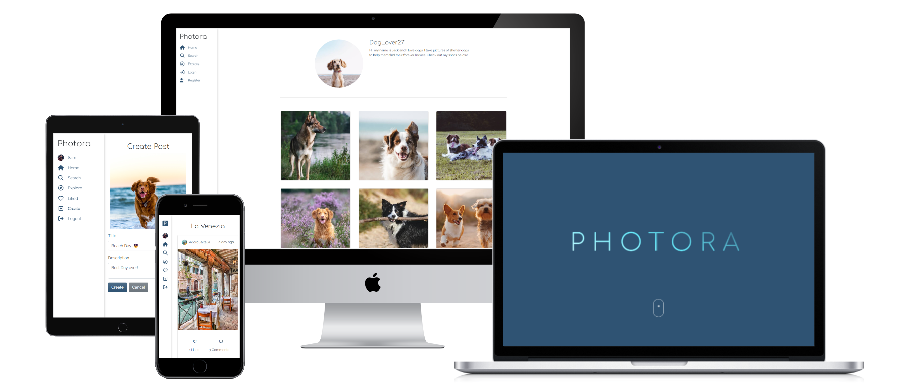

# Objective
The objective of this project is to present my skills in React, Typescript, Django Rest Framework and Python. I also want to demonstrate my proficiency in Object Oriented Programming and other standard programming constructs such as flow control, iteration, selection, functions, and data structures.

# Django Rest Backend
The repository for the backend of the application can be found here: [https://github.com/Cushione/photora_api](https://github.com/Cushione/photora_api)

# Contents
* [Features](#features)
  * [Landing Page](#landing-page)
  * [Sidebar](#sidebar)
    * [Authenticated Links](#authenticated-links)
  * [Post Entry](#post-entry)
  * [User Likes Modal](#user-likes-modal)
  * [Home Page](#home-page)
  * [Search Page](#search-page)
  * [Explore Page](#explore-page)
  * [Liked Page](#liked-page)
  * [Profile Page](#profile-page)
    * [Edit Profile](#edit-profile)
  * [Posts](#posts)
    * [Post Detail](#post-detail)
    * [Create Post](#create-post)
    * [Edit Post](#edit-post)
    * [Like Post](#like-post)
    * [Delete Post](#delete-post)
  * [Comments](#comments)
    * [Add Comment](#add-comment)
    * [Edit Comment](#edit-comment)
    * [Delete Comment](#delete-comment)
  * [Register](#register)
    * [Form Validation](#form-validation)
  * [Login](#login)
  * [Additional Features](#additional-features)
* [Colors](#colors)
* [Testing](#testing)
  * [Manual Testing](#manual-testing)
  * [Validation](#validation)
    * [HTML](#html)
    * [CSS](#css)
    * [TSX](#tsx)
  * [Bugs](#bugs)
* [Development process](#development-process)
  * [Development Preparation](#development-preparation)
  * [Agile Development](#agile-development)
  * [Custom Fields](#custom-fields)
  * [Git](#git)
  * [React](#react)
  * [Vite](#vite)
  * [SCSS](#scss)
  * [Prettier](#prettier)  
* [React Libraries](#react-libraries)
  * [React Router](#react-router-v6)
  * [Zustand](#zustand)
* [Deployment](#deployment)
  * [Deployment Preparation](#deployment-preparation)
  * [Setup](#setup)
* [Credits](#credits)
  * [Used Technologies and Tools](#used-technologies-and-tools)
  * [Content and Media](#content-and-media)
* [Acknowledgments](#acknowledgments)

# FEATURES

## Landing Page

- The landing page is the first page a new visitor sees.
- It contains information about the application and its features, so new users immediately know what the page is about.

## Sidebar
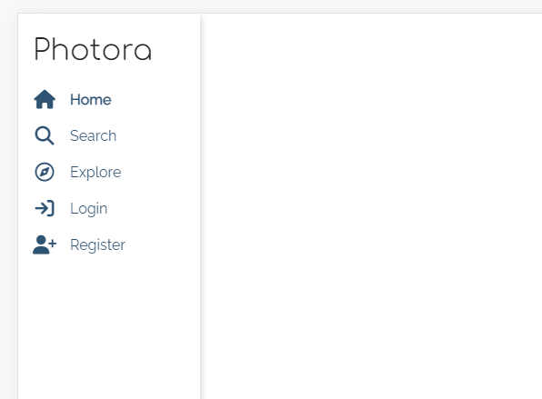
- The sidebar is always visible on every page but the landing page.
- It is fully responsive and includes name at the top and links to all the pages below.
- The sidebar is identical on each page to allow for easy navigation from page to page across all devices.  

### Authenticated Links
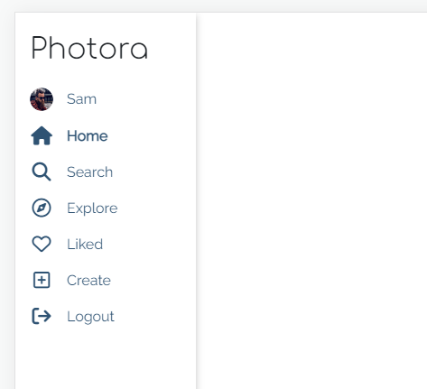
- After logging in, the _login_ and _register_ links in the menu are replaced by the profile link and a log-out button.
- The user can also see the links: _Liked_ and _Create_.
- The user can always see if they are logged in by their username and profile image being displayed. 

## Post Entry
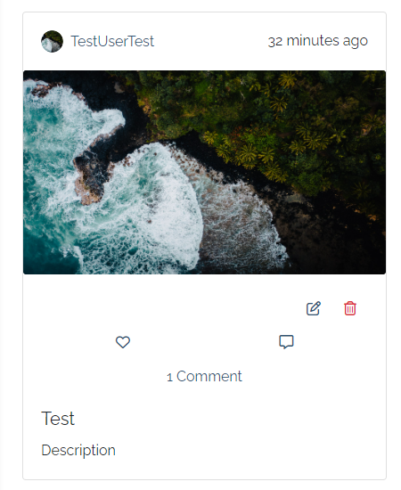
- The Post Entry component is reused throughout the application to display posts.
- At the top of the card, a link to the author's profile and the time since posting is displayed.
- The middle of the card shows the image of the post.
- Below the image, the owner of the post can see buttons to edit and delete the post. All the users can see like and comment buttons, which are only accessible to authenticated members.
- Next to the buttons, users can see the number of likes and comments. Users can click the number of likes to see a list of members who liked the post.

## User Likes Modal
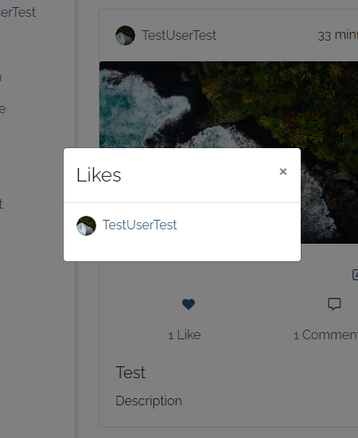
- The modal displays a list of members that like a post.
- For every member, the list shows the profile image and name as a link and a button for the following user.
- The profile link is displayed with the Profile Link component, which is also used in the Post Entry and Comment Card component. The follow button component is also used on the profile page.

## Home Page
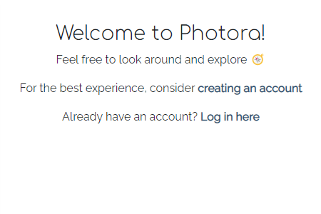
- The Home Page is used to display a welcoming message to new users who are not yet members.

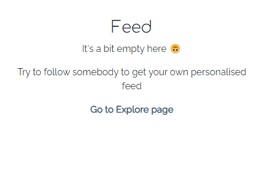
- Members, who have not yet followed anybody, can see a welcome message and a hint to follow somebody other members.

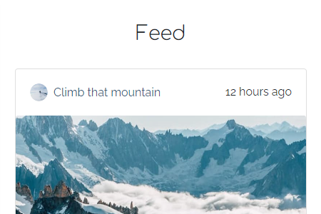
- The posts in the feed are displayed with the Post List component that uses the Post Entry component for every post. The post list component is reused on multiple pages to display a list of posts.

## Search Page
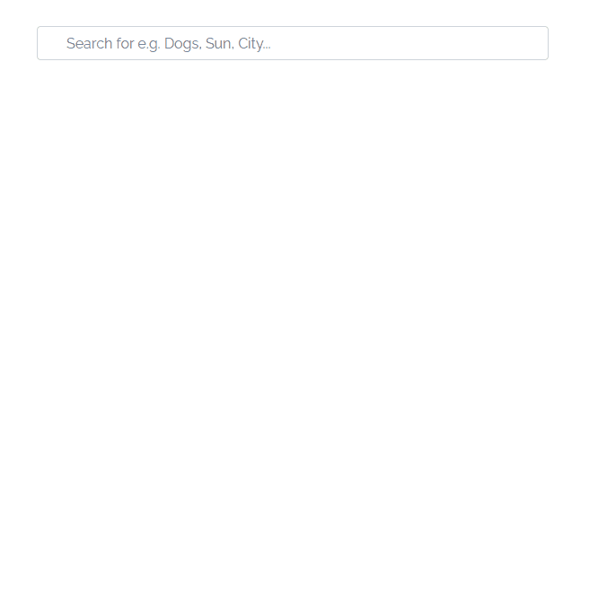
- The user can search for specific posts containing chosen keywords.
- To get a match, the article has to contain selected keywords in either the post title, description, or name of the author.
- The search request is automatically sent after typing and displayed below the search bar. 
- In case there is no match, the page informs the user of the fact by displaying a message.
- The search page uses one of the pages that use the Post List component to display the result.

## Explore Page
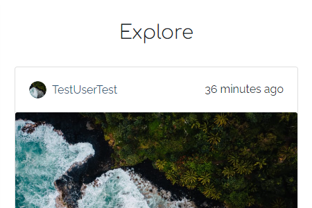
- The explore page allows any user to explore new content.
- This page shows all the posts except posts from the authors themselves and members the author already follows.
- The explore page uses one of the pages that use the Post List component to display the result.

## Liked Page
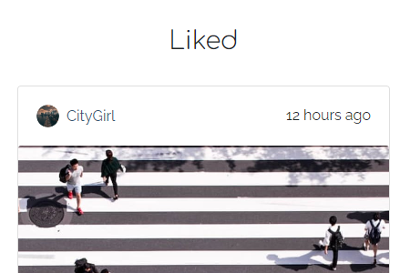
- The liked page allows members to see posts they liked and enjoyed.
- The liked page uses one of the pages that use the Post List component to display the result.

## Profile Page
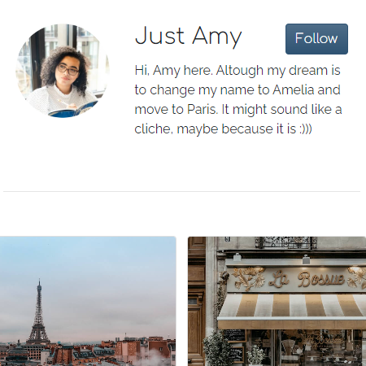
- Every member has a profile page that displays the profile image, name, and biography of the member.
- Members can see a Follow button at the top right corner of other member's profiles that allows them to follow that member to receive that member's posts in their feed.
- Below the profile information, all the posts of the member are displayed in a grid.

### Edit Profile
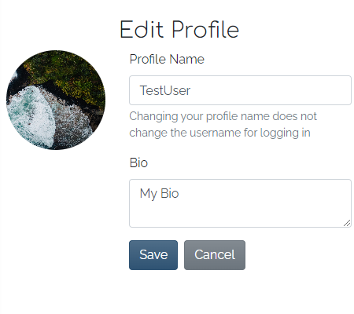
- Every member can edit their profile through the Edit Profile page which is accessible by clicking the edit button in the top right corner of their profile.
- The edit post form allows the user to change their profile image, name, and biography.

## Posts

### Post Detail
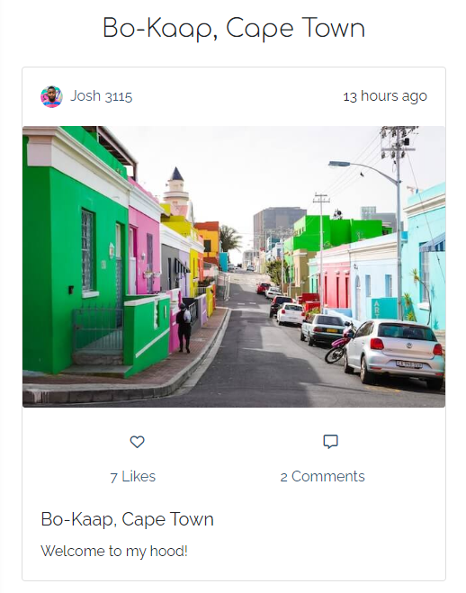
- Every post on the website can be opened by clicking on the image in the post.
- At the top, the detail page shows the title of the post. Below the title, the post is displayed with the [Post Entry component](#post-entry) which is also used in the Post List component. Unlike the Post List component, the image in the Post Detail component is displayed in full resolution and quality.

### Create Post
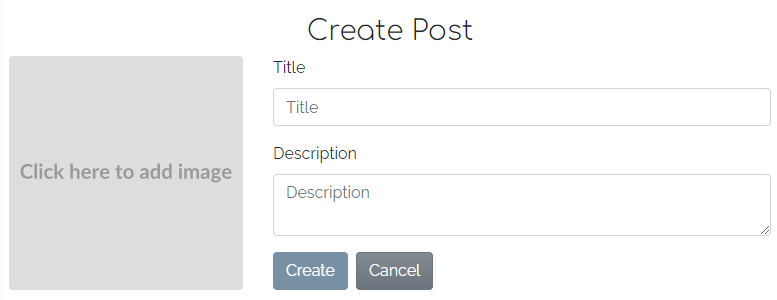
- Posts can be created by members through the Create Post page.
- The page shows the Post Form component which has an image input and two text inputs for the title and description. The image input is the same component as on the Edit Profile page.
- When submitting the form, the post is created and the user is navigated to the profile page where the new post is displayed at the top
- A message informs the user about the successful operation.

### Edit Post
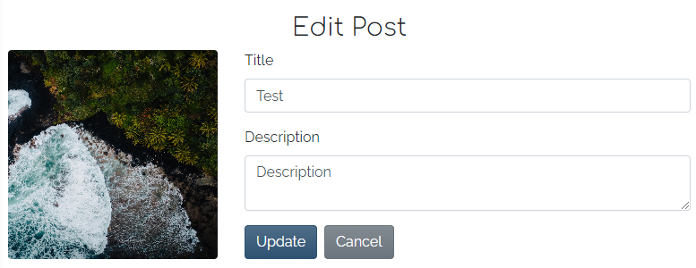
- Post can be edited by the owner of the post through the Edit Post page accessible through the Post Detail page of the post.
- Like the Create Post page, the page also uses the Post Form component but is prefilled with the post data.
- When submitting the form, the post is updated and the user is navigated to the post detail page of the edited post.
- A message informs the user about the successful operation.

### Like Post
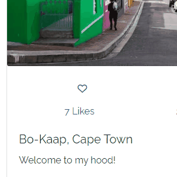
- Post can be liked by all members by clicking the heart button on the Post Card.
- The heart in the button gets filled to inform the user about the successful like.
- Members can revert the like by clicking the button again, which empties the heart.

### Delete Post

- Posts can be deleted permanently by the owner of the post through the Post Detail page.
- In the Post Card component the owner can see a delete button underneath the image.
- When clicking a button, a confirm modal is shown where the user has to confirm the deletion or cancel the action.
- When confirming, the post is deleted and the user is navigated to the profile page. A message informs the user about the successful operation.
- When canceling the deletion, the modal is closed.

## Comments
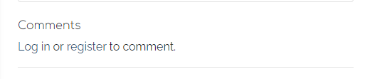
- Every post has a comment section on the detail page.
- If the user is not authenticated, a hint shows that the user needs to log in or register to post a comment.

### Add Comment
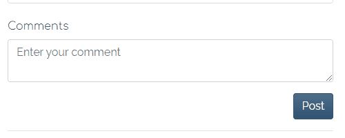
- If the user is authenticated, a comment form is displayed instead of the hint.
- The user can enter the content of the comment and post it by clicking the button.

### Edit Comment
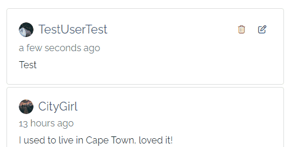
- The user can edit their comment by clicking the edit button in the top right corner.
- The comment turns into an inline form allowing the user to edit the comment.
- To save the changes, the user can click on the save button.
- A message notifies the user about the successful edit.
- If the user changes their mind, and does not want to edit the comment any longer, they can drop the changes by clicking the cancel button.

### Delete Comment
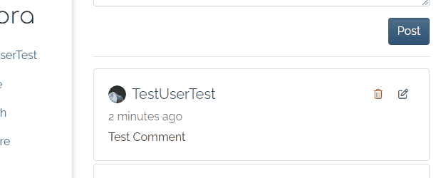
- The user can remove their comments permanently from the conversation.
- To delete a comment, the user can click on the delete button in the top right corner of the comment.
- Before deleting, the user has to confirm their decision, otherwise, the comment will not be deleted.
- A message notifies the user about the successful deletion.

## Register
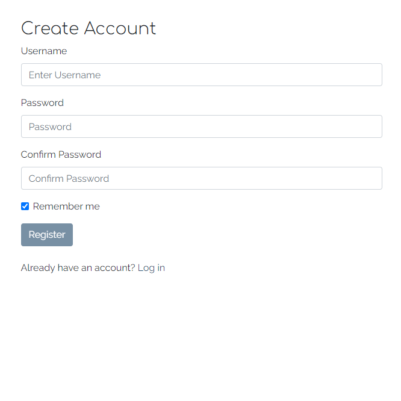
- If a user wants to use the features reserved for members of the website, such as commenting and liking, they have to register.
- The user can reach the registration page by the link in the sidebar or through links available throughout the website.
- To become a member, the user has to enter a username and twice a password.
- If the provided data is valid, the user is automatically logged in and redirected to the Homepage.

### Form Validation
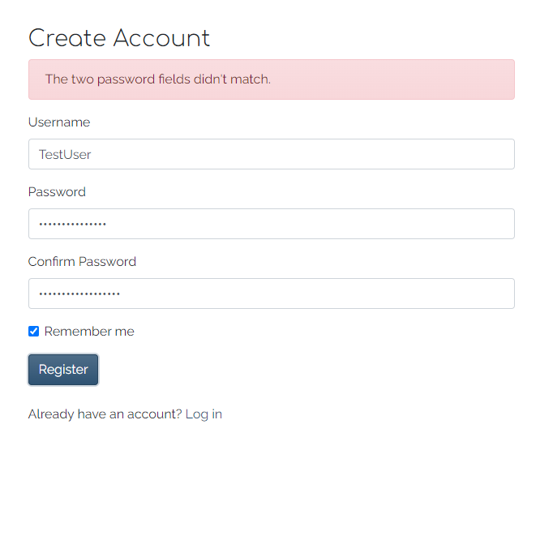
- If the entered data is invalid when sent off, the form data is preserved and an error is displayed. 
- After fixing the invalid fields the user can send the form again.

## Login
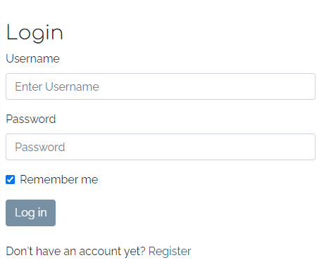
- If an unauthenticated member wants to use the features reserved for members of the website such as commenting and liking, they have to log in.
- The member can reach the login page by the link in the navigation bar or through links available throughout the website.
- To log in, the user has to enter their username and password.
- If the username and/or password are incorrect, the form is loaded again, informing the user about the error.


## Additional Features
Features that could be implemented in the future:
- Allow users to reply directly to another comment. Replies would then be shown directly underneath that comment as a conversation.
- Allow users to upvote/downvote comments and show the most popular comment on top instead of the most recent.
- Allow users to return to a post in the list after opening it in detail. Currently, users are returned to the top of a list when returning from a post detail page.

# Colors
As the primary color for my application, I chose a steel blue color: #2F5373. For the rest of the application, I used the default bootstrap colors.

# Testing

## Manual Testing
- Throughout the development process, I manually tested every page and feature exhaustively.   
[List of manual tests](manual_testing.md)
- When I finished creating my MVP, I shared the website with multiple users to confirm its functionality and to get feedback on their experience.

## Validation
### HTML
[HTML Validation](https://validator.w3.org/nu/?doc=https%3A%2F%2Fphotora.herokuapp.com%2F)  
There were no errors found on any page using the W3C HTML Validator.

### CSS
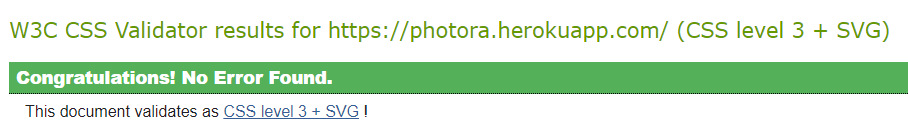  
There were no errors found in the stylesheet using the [W3C CSS Validator](https://jigsaw.w3.org/css-validator/validator?uri=https%3A%2F%2Fphotora.herokuapp.com%2F&profile=css3svg&usermedium=all&warning=1&vextwarning=&lang=en).

### TSX
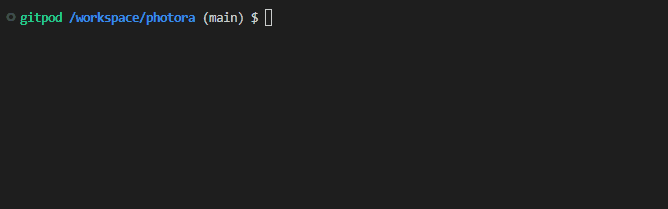  
There were no errors found in the javascript using [ESlint](https://eslint.org/).

## Lighthouse Report
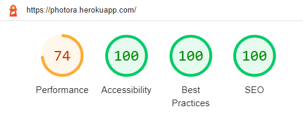  
The website was tested with Google Lighthouse. The performance is low because of the big javascript file. It could be improved by adding lazy loading to the pages loaded by the react router. On the initial page load, only the currently active components would be loaded

## Bugs
There are no known unfixed bugs.

### Fixed Bugs
- After posting a comment, other comments started to appear twice in the list of comments. This was caused by the pagination of the comment list. After posting a comment, all the other comments were shifted by one in the pagination i.e. the last comment on the first page of the list was moved to the first place on the second page.  
In practice: After posting, when the next page of comments was loaded by the infinite scroll, the last comment of the previous page was loaded again as the first comment on the next.
    - Fixed by filtering out existing comments from the list loaded by the infinite scroll before adding them to the display

# Development process
While I was working on this project, I tried to follow an agile development approach as much as possible. 

## Development Preparation
The first step in my development process was to plan the website thoroughly:
- At first, I created a simple class diagram that shows the models I was planning on implementing, with their properties and relations  
  [Link to the class diagram](https://drive.google.com/file/d/1mJWKN7ZxXBxVgPcC8Y_ZCXYZGNR4A8dm/view?usp=sharing)
- Next, I thought about the User Interface and its layout. I created simple [wireframes](docs/images/wireframes.png) for the homepage and the article detail page. 
  - Note: During development, I changed the layout of the post detail page and comments because there would not be enough space and it reduced development time by reusing existing components  
- Lastly, I wrote the majority of my user stories and tasks in my [GitHub Project](https://github.com/users/Cushione/projects/4) 

### Agile Development
- In my [GitHub Project](https://github.com/users/Cushione/projects/4), all my issues are separated into two parts of the application by a custom field "App". Each ticket was assigned one of two milestones: "MVP" and "Additional Features"
- Issues not necessary for my project were added to the "Additional Features" milestone. Those tickets were only to be worked on when all the "MVP" tickets were done and I still had time left.
- Each issue was then categorized into user stories or technical tasks by adding the corresponding label.
- All the issues were then grouped into various epics by a custom field "Epic".
- Every issue was created in added "Unspecified" column. After specification, it was moved to "Todo".
- When I was working on the project, I chose one issue to work on from the "Todo" column of the MVP board and moved it into the "In Progress" column.
- After I finished the issue by fulfilling all the acceptance criteria, I closed the issue which moved it automatically into the "Done" Column.

#### Custom fields
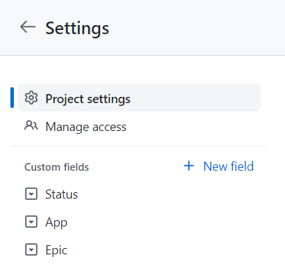
Custom fields were created in the [settings of the GitHub Project](https://github.com/users/Cushione/projects/4/settings)


## Git
- I started the program and repository by creating a new repository on GitHub.
- Then I regularly staged my changes using the command `git add <filename>` and then committed the staged changes to my local repository using `git commit -m 'short descriptive message here'`.
- Finally, I would push the commits from my local repository up to the GitHub repository using the command `git push`.
- With every push, Heroku automatically deploys my latest commit from the 'main' branch to the Heroku app.

## React
The react project was initialised with [create-react-app](https://www.npmjs.com/package/create-react-app) build tool and the [template](https://github.com/Code-Institute-Org/cra-template-moments.git) provided by Code Institute:   
```npx create-react-app . --template git+https://github.com/Code-Institute-Org/cra-template-moments.git --use-npm```

## Vite
After initialising the project with [create-react-app](https://www.npmjs.com/package/create-react-app), I migrated to [Vite](https://vitejs.dev/) through the following steps:
- First, I added the following dependencies to my project with the command ```npm install [page_name]```:
    - [vite](https://www.npmjs.com/package/vite)
    - [sass](https://www.npmjs.com/package/sass)
    - [@vitejs/plugin-react](https://www.npmjs.com/package/@vitejs/plugin-react) 
    - [@types/react-dom](https://www.npmjs.com/package/@types/react-dom)
- I replaced the react-scripts npm scripts in the _package.json_ with the vite commands and removed react-scripts from the dependencies
- I added the following _vite.config.js_ to the root of my application:
```js
import { defineConfig } from 'vite'
import react from '@vitejs/plugin-react'

export default defineConfig({
  plugins: [react()],
  build: {
    outDir: 'build'
  }
})
```
- I removed all the _%PUBLIC_URL%_ from the index.html and moved the file to the root of my application
- The last step was to change the file endings of all the Javascript (.js) and stylesheet (.css) files in the src folder to .tsx and .scss respectively (apart from reportWebVitals.js and setupTests.js)

## SCSS
- The styles in the project are written in SCSS stylesheets.
- The SCSS files are automatically compiled to CSS by the [Vite](https://vitejs.dev/) build tool with the [sass compiler](https://www.npmjs.com/package/sass) 

## Prettier
The Typescript and SCSS files were formatted during the development with the [Prettier](https://prettier.io/) library. The following steps were taken to set up Prettier in the project:
- First, I install the [Prettier package](https://www.npmjs.com/package/prettier) in my project with the command ```npm install prettier```
- Then I added a prettier config file _.prettierrc.json_ to the root of the project and added the following configuration:
```json
{
  "semi": false,          # No semicolons
  "singleQuote": true,    # Use single quotes
  "printWidth": 80,       # Max line length
  "jsxSingleQuote": true  # Use single quotes in jsx code
}
```
- The last step was to add a _.prettierignore_ file and list all the files that should not be formatted by Prettier:
```
build
coverage
public
package.json
package-lock.json
.vscode
.prettierrc.json
README.md
```

# React Libraries

## React Router V6
The application uses the [React Router](https://reactrouter.com/en/main) library for the routing within the application and also data fetching through loaders and form submission with actions. The React Router is the go-to solution for routing in React applications. The latest version also handles data loading and writing which makes it easy to keep the UI in sync with the data.

## Zustand
Instead of the built-in Context feature, the application uses the [Zustand](https://github.com/pmndrs/zustand) library for data that needs to be accessible in the whole application. Information about the user and access to messages is needed inside and outside of components like data loaders and actions. The Context feature only provides access through hooks that are only available in components whereas Zustand has a built-in way to access the state from outside components.

# Deployment

The app was deployed using Heroku and the [NGINX Heroku Buildpack](https://github.com/heroku/heroku-buildpack-nginx). NGINX was used to allow users to access the application through deep links e.g. [photora.herokuapp.com/posts/11](https://photora.herokuapp.com/posts/11). The [serve](https://www.npmjs.com/package/serve) library by Vercel that is suggested by Code Institute only allowed the user to open the landing page of the application and showed a 404 error page for deep links.

## Deployment Preparation
Before the deployment, the following steps were taken to prepare the application for the deployment on Heroku with NGINX:
- I created a file "nginx.conf.erb" in the folder "config" in the root of the application. As the starting point for the config, I used the [sample config](https://github.com/heroku/heroku-buildpack-nginx/blob/main/config/nginx-solo-sample.conf.erb) provided by the [NGINX Heroku Buildpack](https://github.com/heroku/heroku-buildpack-nginx).
    - I replaced line 37 of the sample config _root /app/public; # path to your app_ with the following:
    ```erb
    	# Path to the root of the application i.e. the output folder of the build
        root build;
		# File name of the index file 
        index index.html;

		# Location block that will be used to process incoming requests
        location / {
			# For every request try the following
			# - Check if a file can be found with the URI, if so serve that file
			# - Check if a file can be found with the URI and trailing slash, if so serve that file
			# - Check if a file can be found with the URI with added .html, if so serve that file
			# - If no files can be found, serve the index.html
			# - If no index.html can be found, show 404 error
            try_files $uri $uri/ $uri.html /index.html =404;
        }
    ```
- The nginx start command `web: bin/start-nginx-solo` was stored in a Procfile.

## Setup
The steps to deploy the React app to Heroku are as follows:
- Create a new App from the Heroku dashboard.
- Enter a name for the app and select a region, then click on "Create App".
- On the page of the app that opens, go to the "Settings" tab.
- In Settings add the necessary config vars, for this project I added the URL of my backend.
- Next, add the buildpacks "heroku/nodejs" and "https://github.com/heroku/heroku-buildpack-nginx.git".
- Afterwards, go to the "Deploy" tab on the app page.
- In the "Deployment method" section, select "GitHub" and follow the steps to connect Heroku with GitHub.
- Then, in the "Connect to GitHub" section, search for the repository that is supposed to be deployed and click on "Connect".
- The last step is to either:
    - enable automatic deployment by clicking on the button "Enable Automatic Deploys" in the "Automatic Deploys" Section.
    - deploy a branch manually by selecting the branch and clicking the button "Deploy Branch" in the "Manual deploys" section.

The live link can be found here: [Photora](https://photora.herokuapp.com/)

# Credits

## Used Technologies and Tools
- [Vite](https://vitejs.dev/) - As the build tool
- [Bootstrap](https://getbootstrap.com/) - As the CSS framework
- [Black](https://black.vercel.app/) - For formatting Python code
- [Prettier](https://prettier.io/) - For formatting Javascript code
- [Heroku](https://www.heroku.com/) - For the deployment of the website
- [ElephantSQL](https://www.elephantsql.com/) - As the database provider
- [Cloudinary](https://cloudinary.com/) - As the image storage

## Content and Media
- All the images posted on the website by me were downloaded from [Unsplash](https://unsplash.com/)
- All the icons on the website are from [FontAwesome](https://fontawesome.com/)
- The fonts [Comfortaa](https://fonts.google.com/specimen/Comfortaa) and [Raleway](https://fonts.google.com/specimen/Raleway) are from [Google Fonts](https://fonts.google.com/)


# Acknowledgements

I would like to acknowledge the following people who have helped me along the way in completing my final portfolio project:
- My husband, Moritz Wach, for all his knowledge and relentless support.
- My mentor, Spencer Barriball, for his guidance and inspiration.
- My friends and colleagues for testing the website rigorously and sharing posts and writing comments.